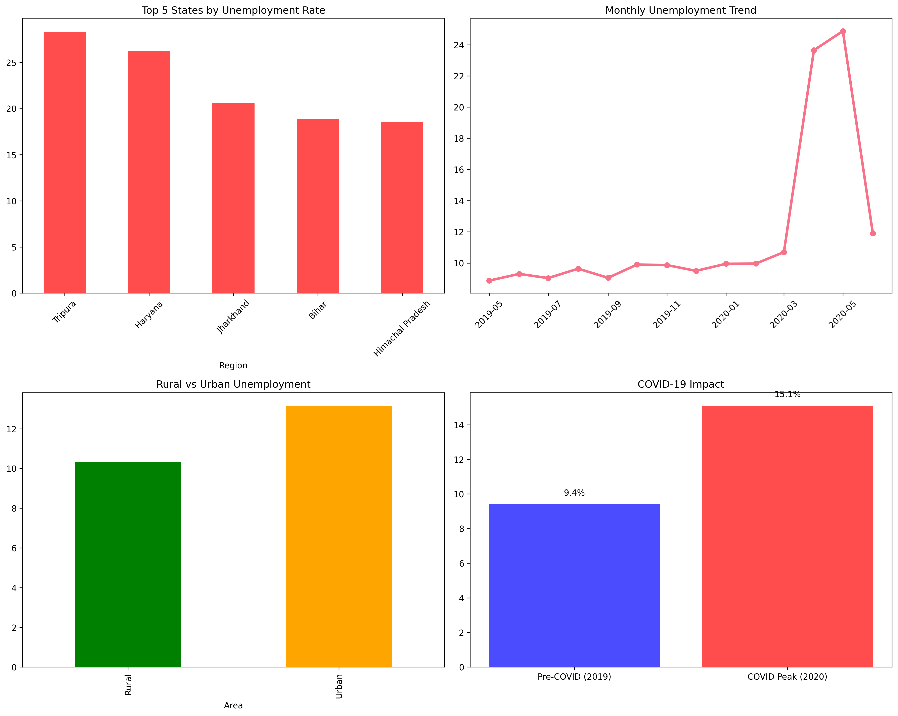

# CodeAlpha_Data_Science
# CodeAlpha Unemployment Analysis (Task 2)

Analyzes India unemployment data (2019-2020), focusing on COVID-19 impact, trends, and patterns using Python.[file:1][file:2]

## Dataset
'Unemployment-in-India.csv': Monthly % rates by Region (e.g., Andhra Pradesh, Bihar), Area (Rural/Urban), 2019-2020.[file:2]

## Key Findings
- **Pre-COVID Avg**: ~5-6% nationally; regional highs in Bihar (~10%).[file:2]
- **COVID Impact**: Spiked to 20-47% in Apr-May 2020 (e.g., Bihar Rural 45%, Tamil Nadu Urban 53%); rural hit harder due to lockdowns/migration.[file:2]
- **Seasonal Trends**: Minor pre-COVID fluctuations; pandemic erased patterns with peak in summer lockdown.[file:2]
- **Patterns**: Urban recovery faster by Jun; Labour Participation dropped ~5-10% indicating discouraged workers.[file:2]

| Metric | Pre-COVID | COVID Peak (Apr-May 2020) |
|--------|-----------|---------------------------|
| National Avg | 6.5% | 25%+ |[file:2]
| Highest Region | Bihar (10%) | Jharkhand/Bihar (45-55%) |[file:2]
| Rural vs Urban | Rural higher baseline | Rural spiked more |[file:2]

## Insights for Policy
- Prioritize rural Bihar/Jharkhand with job schemes.
- Boost urban skilling amid recovery.
- Monitor LP Rate for underemployment.[file:2]

## Run Instructions
1. `pip install -r requirements.txt`
2. `python unemployment_analysis.py`
3. View `unemployment_analysis.png` & `unemployment_summary.csv`.

## Author
[Karan Askand], Computer Engineering Student

